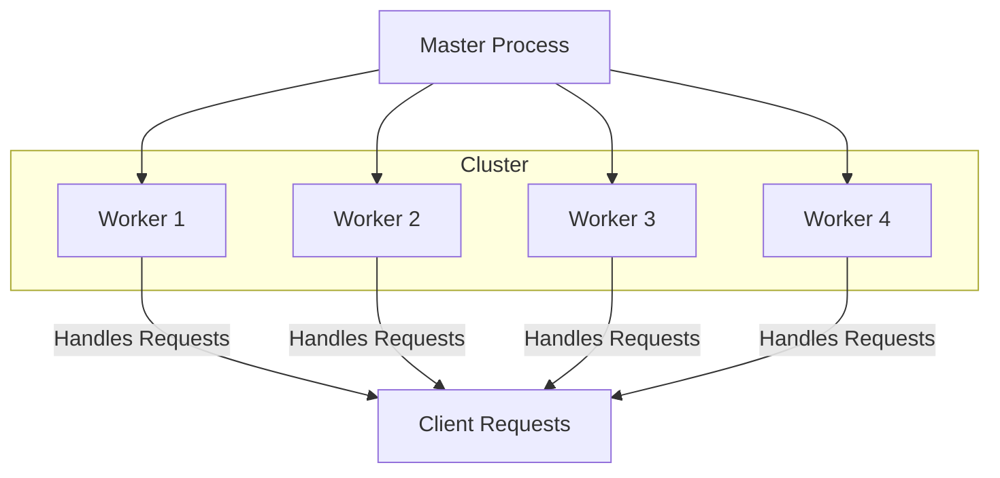
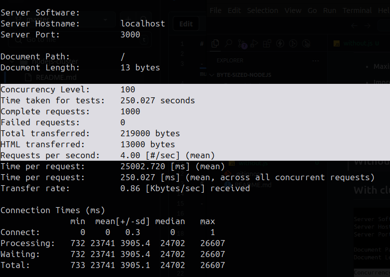
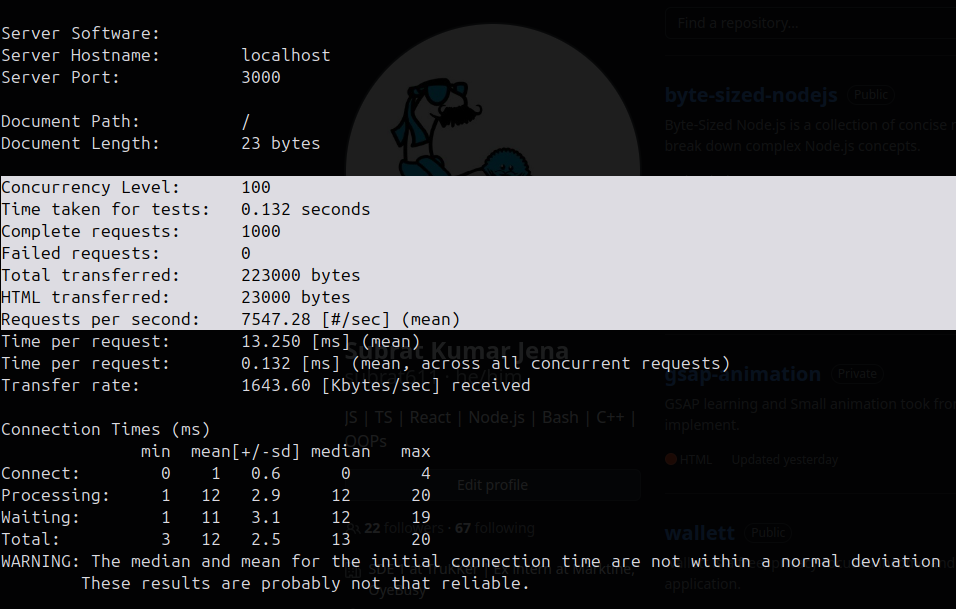

# What is Clustering?

- Clustering is a way to create multiple instances (or "workers") of a Node.js application that can share the same server port and run concurrently, allowing the application to take full advantage of multi-core processors.

# Why Use Clustering?

- **Single-threaded Limitation:** Node.js, by default, runs in a single-threaded environment. This means that only one CPU core is utilized, even if your server has multiple cores.

- **Scaling:** Clustering allows you to create a "cluster" of Node.js processes to better distribute incoming traffic, increasing performance and reliability by balancing the load across all available CPU cores.

- **Fault Tolerance:** If one worker crashes, the others can continue serving requests, improving the application's fault tolerance.

# How to Implement Clustering in Node.js (Using Express)

- [x] Check the `server.js` file

## Explanation of Code:

- **Master Process:** The code checks if the current process is the master (i.e., the main process). The master process doesn't handle requests itself but forks worker processes (one for each CPU core).

- **Worker Process:** Each worker is a separate Node.js process that runs the Express app and handles requests independently. When a request comes in, it is forwarded to one of the worker processes.

- **Fault Tolerance:** If a worker dies, the master process will detect it and automatically fork a new worker to replace it.

# Clustering Flow Diagram

# Advantages of Using Clustering

- **Maximizes CPU Utilization:** It makes full use of all available CPU cores.

- **Improves Application Availability:** If a worker crashes, others continue working.

- **Handles More Requests:** With multiple workers, the server can handle more incoming traffic simultaneously.

# Load Test

## Without cluster

**Time taken: 250.027 seconds**

## With cluster

**Time taken: 0.132 seconds**

